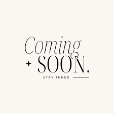

# W. Jordan Charles Portfolio

A modern, responsive portfolio showcasing my work as an Instructional Designer & Learning Solutions Developer. Built with React and Tailwind CSS, focusing on clean design and engaging user experience.


<!-- TODO: Replace with actual screenshot of your portfolio -->

## ✨ Features

- **Modern Design**: Clean, responsive interface built with Tailwind CSS
- **Smooth Animations**: Page transitions and interactions using Framer Motion
- **Project Showcase**: Dynamic portfolio grid with filtering capabilities
- **Contact Form**: Interactive contact system
- **Responsive Layout**: Optimized for all device sizes
- **Error Handling**: Robust error boundaries and fallbacks

## 🚀 Quick Start

1. **Clone the repository**
```bash
git clone https://github.com/williamthe5thc/Portfolio.git
cd Portfolio
```

2. **Install dependencies**
```bash
npm install
```

3. **Start development server**
```bash
npm run dev
```

4. **Build for production**
```bash
npm run build
```

5. **Deploy to GitHub Pages**
```bash
npm run deploy
```

## 💻 Tech Stack

- **Frontend Framework**: React 18
- **Styling**: Tailwind CSS
- **Animations**: Framer Motion
- **Routing**: React Router 6
- **Build Tool**: Vite
- **Icons**: Lucide React
- **Deployment**: GitHub Pages

## 📂 Project Structure

```
Portfolio/
├── src/
│   ├── components/          # Reusable UI components
│   │   ├── shared/         # Common components
│   │   └── ui/             # Basic UI elements
│   ├── data/               # Site content and configuration
│   ├── hooks/              # Custom React hooks
│   ├── pages/              # Page components
│   └── styles/             # Global styles
├── public/                 # Static assets
│   └── images/            
└── config files           
```

## 🔧 Configuration

The site can be customized through several configuration files:

- `src/data/siteData.js`: Main content configuration
- `tailwind.config.js`: Theme and styling customization
- `vite.config.js`: Build and development settings

## 📱 Responsive Design

The portfolio is fully responsive across devices:
- Desktop (1024px+)
- Tablet (768px - 1023px)
- Mobile (320px - 767px)

## 🎨 Color Scheme

```javascript
// Primary Colors
primary: {
  600: '#0284c7', // Main brand color
  700: '#0369a1', // Hover states
}

// Background
background: {
  light: '#f8fafc',
  DEFAULT: '#f1f5f9',
}

// Text Colors
text: {
  primary: '#1e293b',
  secondary: '#64748b',
}
```

## 🔄 Update Guide

To update the portfolio content:

1. **Content Updates**
   - Edit `src/data/siteData.js` for text and metadata
   - Add new project images to `public/images/projects/`

2. **Deployment**
   - Run `npm run build` to create production build
   - Run `npm run deploy` to publish to GitHub Pages

## 👤 Contact

Jordan Charles
- 📧 Email: williamthe5thc@gmail.com
- 🔗 LinkedIn: [jordan-charles](https://linkedin.com/in/jordan-charles)
- 📍 Location: Salt Lake City, Utah

## 📈 Future Enhancements

Planned improvements:
- [ ] Add case studies for key projects
- [ ] Implement dark mode
- [ ] Add analytics tracking
- [ ] Enhance project filtering
- [ ] Add testimonials section

 Future Enhancements
🎯 In Progress
update code so that each function is it's own file 

Enhanced project card animations for better user engagement
Scroll improvements including Back to Top button
Enhanced core competencies animations
Analytics implementation for user behavior tracking
Accessibility improvements (WCAG compliance)
Contact form submission functionality

🧭 Navigation Improvements

Implementation of subtle underline animation for nav items
Enhanced current page indicator
Improved mobile navigation experience
Breadcrumb navigation for deeper pages

🎨 Visual and UI Enhancements

Creative loading screen with branded animation
Smoother page transitions
Dark mode implementation
Enhanced hover states and micro-interactions

📝 Content Additions

Documentation Integration

Resume PDF viewer integration
Cover letter showcase
Downloadable professional documents


Portfolio Expansion

Additional work samples with detailed case studies
Project metrics and quantifiable results
Before/after comparisons for projects
Integration with external presentations and demos


Social Proof

Testimonials section (when available)
Client feedback integration
Project success stories


🔗 External Integration

Links to live project demonstrations
Integration with presentation platforms (SlideShare, etc.)
Connection to external learning modules
Portfolio piece preview functionality

🛠 Technical Improvements

Performance Optimization

Image optimization and lazy loading
Code splitting for faster load times
Cache optimization
Performance metrics monitoring


Development Workflow

Enhanced build process
Automated testing implementation
CI/CD pipeline improvements
Code quality tools integration


SEO and Analytics

Enhanced meta data
Schema markup implementation
Advanced analytics tracking
Performance monitoring


💡 Interactive Features

Interactive project timelines
Filterable project gallery
Dynamic skill visualization
Interactive learning samples

📱 Responsive Enhancements

Enhanced mobile experience
Touch-friendly interactions
Responsive images and media
Mobile-first animations

🔒 Security Updates

Form submission security
Content protection
Data encryption
Security best practices implementation

Implementation Timeline
Phase 1 (Next 30 Days)

Navigation animations and improvements
Loading screen implementation
Initial content additions (resume, cover letter)
Basic analytics setup

Phase 2 (60-90 Days)

Project metrics integration
External presentation links
Enhanced project cards
Testimonials section structure

Phase 3 (90+ Days)

Advanced interactive features
Full accessibility implementation
Complete analytics integration
Performance optimizations

Contributing
Feedback and suggestions are welcome! Please feel free to submit issues or pull requests to help improve this portfolio.
Updates and Maintenance
This portfolio is actively maintained and updated. Check back regularly for:

New project additions
Updated content and demonstrations
Enhanced features and functionality
Improved user experience elements

## 📄 License

This project is licensed under the MIT License.